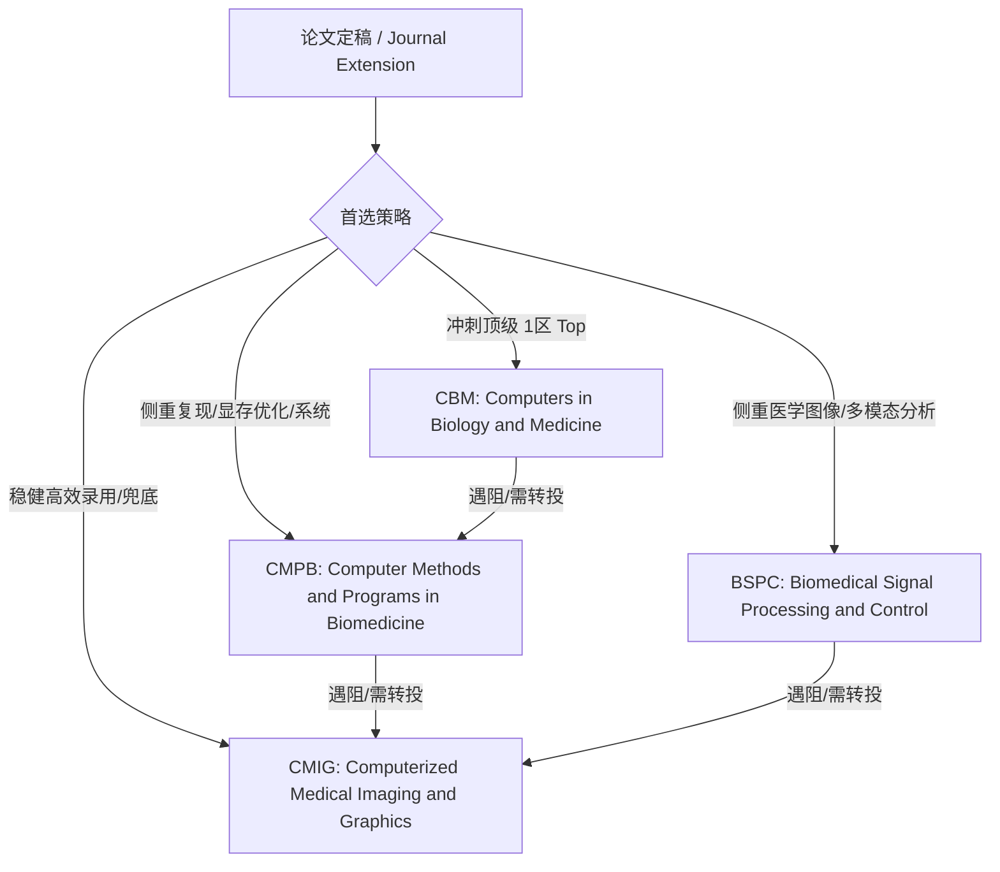

# 投稿期刊列表与投递策略 (Target Journals & Submission Strategy)

本文档记录 **ApproxDA-TransUNet / AdaDA-TransUNet** 项目的推荐投稿期刊、中科院分区、投稿难度以及对应的投递策略与论文匹配度分析。

---

## 1. 期刊概览与对比汇总

| 期刊简称 | 刊物全称 | 出版社 | 中科院分区 | 投稿难度（相对 Frontiers） | 建议投递策略 / 适用场景 | 本项目匹配度 / 定位 |
|---|---|---|---|---|---|---|
| **CBM** | *Computers in Biology and Medicine* | Elsevier | **1区 (Top)** | 基本持平 | **首选冲刺**：如果算法有一定创新性，且在公开医学数据集上表现很好，首选冲刺。 | 🎯 **冲刺首选 (Top 1区)** 5大跨模态数据集与 GCS 谱线理论支撑充分 |
| **BSPC** | *Biomedical Signal Processing and Control* | Elsevier | **2区** | 基本持平 | **侧重视觉/临床**：如果工作偏向医疗图像、视频或临床多模态视觉分析。 | 🎯 **优质2区 (视觉/多模态)** 涵盖 CT / MRI / 内镜 / 皮肤镜等多种医学模态 |
| **CMPB** | *Computer Methods and Programs in Biomedicine* | Elsevier | **2区** | 基本持平 | **侧重复现/效率**：如果论文除了算法，还强调了代码复现、计算效率或系统方案。 | 🎯 **优质2区 (高度契合)** 强调显存优化(6.4G vs 11.5G)、DDP多卡支持与可控实验框架 |
| **CMIG** | *Computerized Medical Imaging and Graphics* | Elsevier | **2区** | 稍低（更容易） | **稳妥保底**：如果实验数据量较小，或者创新点属于稳扎稳打型，用它来兜底。 | 🛡️ **稳健保底** 扎实的医学图像分割实验与注意力机制分析 |
| **JBHI** | *IEEE Journal of Biomedical and Health Informatics* | IEEE | **1区 (Top)** | 略高 | **IEEE旗舰**：生物医学与健康信息学顶级期刊，强调方法完整性、理论深入度与广泛实验。 | 🎯 **IEEE系列冲刺备选** |
| **Frontiers** | *Frontiers in Bioengineering and Biotechnology* | Frontiers | **2区 / 3区** | 基准 (Baseline) | **基线同源**：DA-TransUNet 原文发表期刊，同源对比扩展，接受度高、审稿相对较快。 | 🔄 **基线对标 / 同源备选** |

---

## 2. 目标期刊详细分析与投递建议

### 1. Computers in Biology and Medicine (CBM)
- **出版社**：Elsevier
- **分区**：中科院 1区 (Top 期刊)
- **相对难度**：与 Frontiers 基本持平，但分区含金量更高 (1区 Top)。
- **投递策略**：**冲刺首选**。适合算法具有明确创新点（如上下文敏感性 GCS 理论、门控坍缩机理），且在多个公开基准医学数据集（Synapse, ACDC, Kvasir-SEG, ISIC 2018, CVC-ClinicDB）上均取得一致性能提升与充分消融验证的情况。

### 2. Biomedical Signal Processing and Control (BSPC)
- **出版社**：Elsevier
- **分区**：中科院 2区
- **相对难度**：与 Frontiers 基本持平。
- **投递策略**：**侧重医学影像与多模态**。如果论文突出展示算法在 CT 多器官、MRI 心脏、内窥镜息肉和皮肤镜病灶等多模态医学图像上的泛化能力与临床视觉分析价值，BSPC 是非常匹配的优质目标。

### 3. Computer Methods and Programs in Biomedicine (CMPB)
- **出版社**：Elsevier
- **分区**：中科院 2区
- **相对难度**：与 Frontiers 基本持平。
- **投递策略**：**侧重计算效率、系统与复现**。如果论文除了理论创新，还重点强调了：
  1. 显存大幅降低（6.4 GB vs. 11.5 GB，下降 44.3%）；
  2. 彻底解决 DA-TransUNet 原生在 DDP 多卡分布式训练时的显存溢出与崩溃问题；
  3. 提供可控的近似注意力实验评估框架与高复现性开源方案。  
  *CMPB 审稿人极其看重方法在计算工程和软件/程序落地层面的价值，本项目高度契合该期刊。*

### 4. Computerized Medical Imaging and Graphics (CMIG)
- **出版社**：Elsevier
- **分区**：中科院 2区
- **相对难度**：稍低（更容易）。
- **投递策略**：**稳健兜底**。如果希望快速且稳妥录用，或审稿周期要求紧凑，CMIG 是非常可靠的 2 区兜底期刊。该刊专注于计算机化医学成像与图形学，对严谨扎实的医学图像分割实验具有良好的包容度。

---

## 3. 投递路线规划建议

